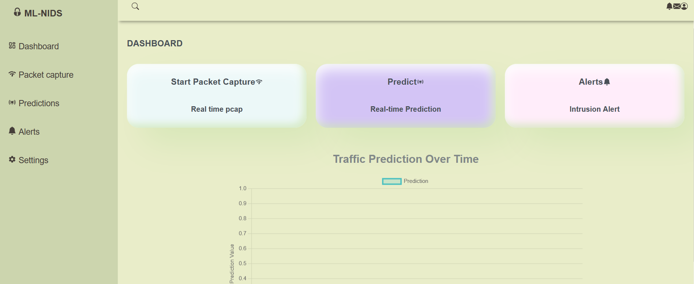

# Machine Learning Network Intrusion Detection System with UI
This project entails an anomaly-based NIDS that uses machine learning to identify patterns that deviate from what is considered the "normal" behaviour of the network. It's basically just identifying intrusions(attacks), and normal network flow.
The system has the following major components:
 1. A detection engine; which is the Machine Learning model
 2. A packet capture engine 
 3. An alert system
 4. A database
 5. A Graphical User Interface

## Detection engine
The detection engine is a machine learning model developed using MLP(Multi-Layer Perceptron) which is a type of neural network. The major preprocessing steps include data cleaning(just basically getting rid of duplicates and what not), then label encoding, and then feature selection using XGBoost algorithm. 

******************************** 
### disclaimers
By the way, I forgot to apply a threshold inorder to pick the most important features, so yes, the model was trained on a bunch of unnecessary features, but the accuracy was pretty good, however I did notice it performs poorly on synthetic data cause duh... it's synthetic data, and the model was trained on real world data(CICIDS2017 dataset). There was also an issue with class imbalance in the labels, I tried to use smote and GAN to try and generate some data to fix that but I didn't have enough RAM to do it. So if you have enough RAM try doing that to fix that issue, moving on...

********************************

The saved models are available in the saved models folder.
So I also made a streamlit app if you'd like to test the model, I have provided datasets that contain real world network traffic in the packet capture dataset. The network traffic is from a Wi-Fi network.The streamlit app is in the NIDS_preview.py file, you'll need to load the pipeline(in the saved models folder) then run the streamlit app.

## Packet Capture Engine
So this is just like wireshark(a tool used for packet capture and just network analysis in general), but using the pyshark library from python. 
The engine is set to have a duration of 60 seconds for packet capture and does this on a Wi-Fi network.
The captured packets are also logged into the table in the database after the 60 seconds duration is up.
It also includes some calculations for some of the features used to train the model. Another disclaimer; It doesn't include all the calculations.

## Alert system
This sends alerts of attacks labeled as critical and High, to email. And yet another disclaimer, you'll have to hardcode the email address of the sender(most probably the admin in a real world setting, I'm just guessing) and receiver, it would be better if you create a mailing system for your users.

It also logs threats into a table in the database.

## The database
So here just entails the backend in general.
I setup a postgresql database for logging packets and performing predictions on them. The predictions are then logged into a predictions table in the database(modelconnectdb.py script perfoms predictions and logs them into the database).

If you plan on using this code or testing it out, you have to make sure you have a .ini file for your database configurations.

Also, there are the django apis created using the django-restframework. Check them out in the djangonids folder. 

## Graphical User Interface
The UI is created using react js and css, it entails a home page with 3 buttons. One for triggerring packet capture, another for triggering predictions, and the other for triggering alerts. The home page also has a chart for displaying the predictions.
Ckeck it out in the FRONTEND folder. 

### preview of the frontend

## Daily tuko mboka.